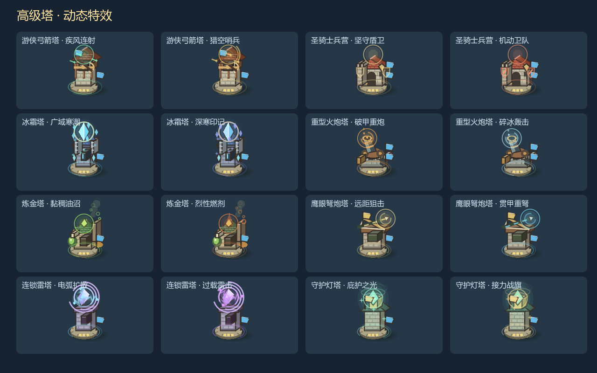

# 高级塔动态特效 · 2026-10-05

八种最终塔、十六种三级分支增加动态特效，选定分支后显示。两条分支使用不同配色；普通基础塔不会显示高级光环。

| 塔型 | 高级形态特效 |
|---|---|
| 游侠弓箭塔 | 环绕飞矢、绿色／金色光痕、猎空瞄准弧 |
| 圣骑士兵营 | 两侧悬浮圣盾、机动分支的冲锋纹路 |
| 冰霜塔 | 环绕冰晶、飘散雪光、青色／紫蓝晶芒 |
| 重型火炮塔 | 炮口充能环、上升余烬、橙色／冰蓝弹道 |
| 炼金塔 | 上升气泡、荧绿药剂光、烈性分支火苗 |
| 鹰眼弩炮塔 | 弩臂流动能量、箭尖聚能环、金色／青色箭迹 |
| 连锁雷塔 | 晶核与环绕电球间的跳动电弧、蓝色／紫色闪电 |
| 守护灯塔 | 上升圣光环、漂浮星芒、绿色／金色光晕 |

各塔配有贴近底座的旋转符文，真实攻击和主动技能会触发短暂能量脉冲。高级塔弹道带有相应颜色拖尾，全部十六项主动技能改用对应塔型的箭雨、冰晶、电击、圣光或冲击效果。塔受到干扰、封锁或正在施工时，环境光效降低亮度。

特效采用现有 Canvas 绘制，使用固定数量的线段与粒子，不创建持续累积的节点，也不修改战斗伤害、费用、权限或冷却规则。部分原有技能音效事件保留原类型，附加塔型信息用于绘制。

验证：界面回归 16/16，策略扩展规则 221/221；GPU 预览覆盖十六种分支、十六项技能、三个动画时刻与实际战场接入。预览脚本 `game/tests/visual_tower_fx.gd`，日志位于 `.work/tests/tower-fx-*.log`。便携包重新生成并检查启动。未额外重跑整套经济通关，也未做低端显卡性能实测。

